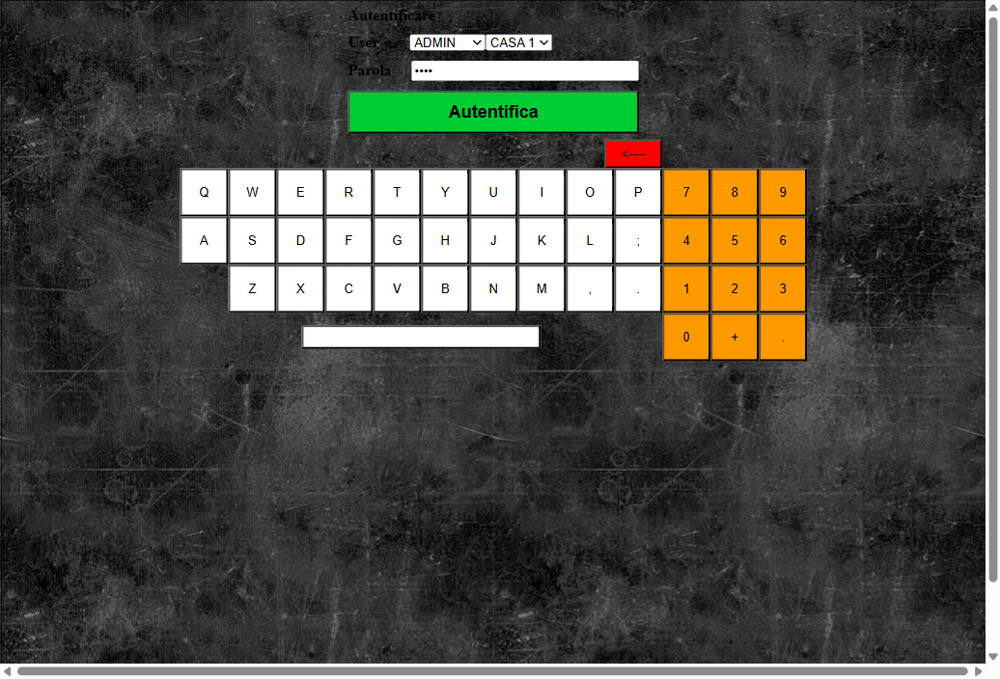
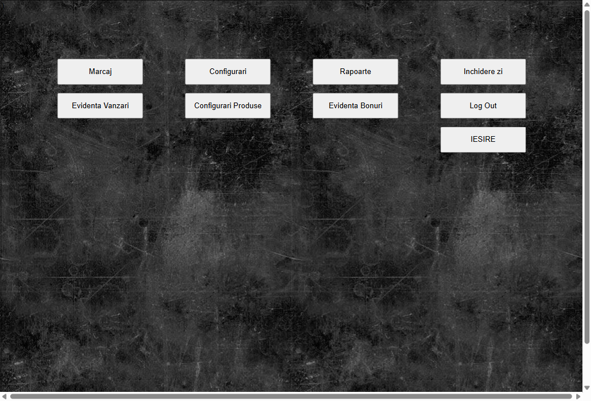
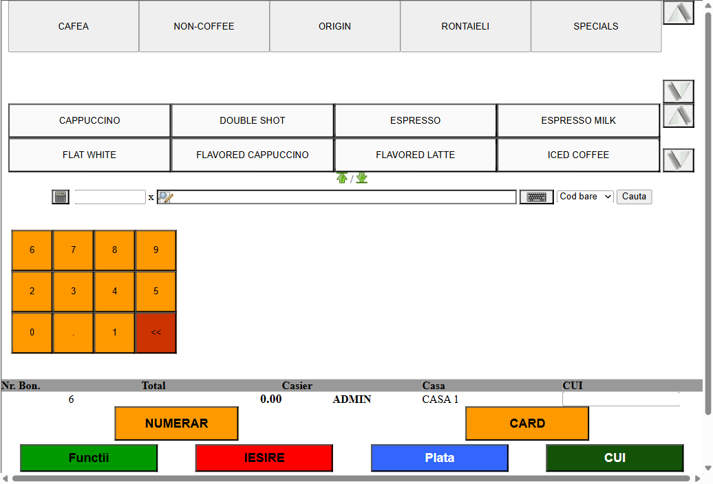
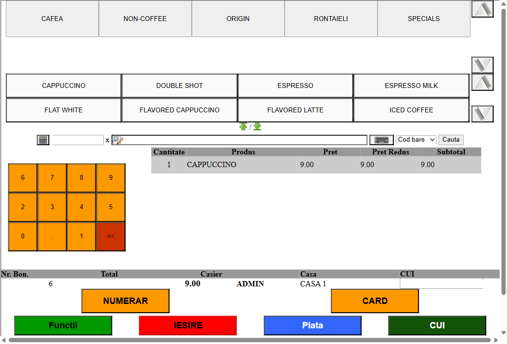
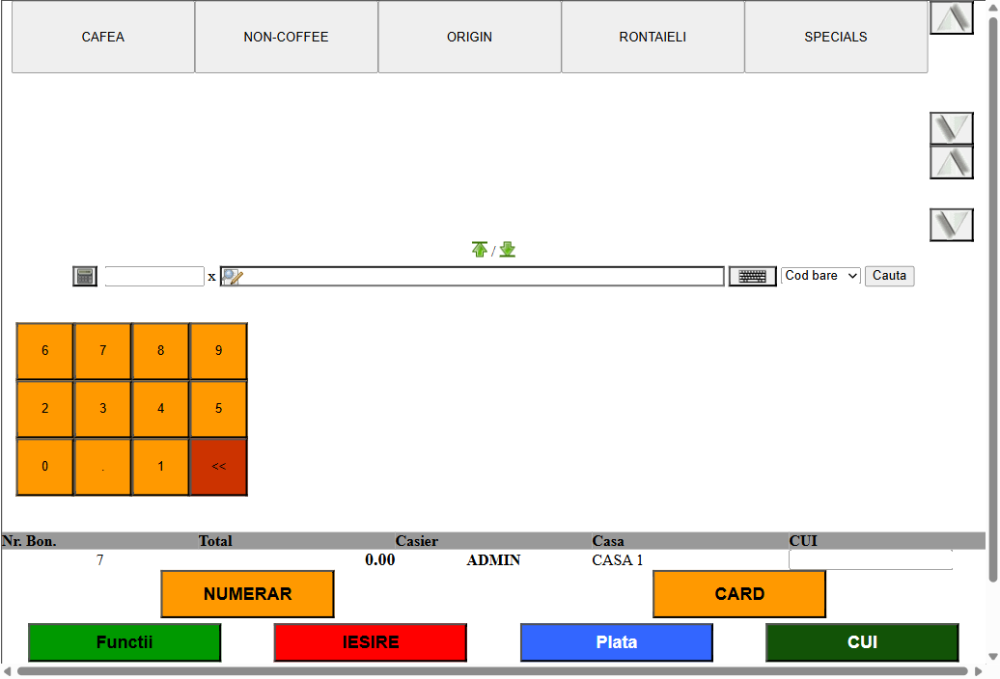

# Plasare Comanda

## Autentificare

1. Accesati aplicatia la adresa `http://localhost`.
2. Veti fi redirectionat catre pagina de login.
3. Selectati utilizatorul din dropdown-ul **User** (ex: ADMIN).
4. Selectati casa de marcat din dropdown-ul alaturat (ex: CASA 1).
5. Introduceti parola folosind tastatura virtuala afisata pe ecran (tastele numerice sunt marcate cu portocaliu).
6. Apasati butonul verde **Autentifica**.

7. Dupa autentificare, veti vedea meniul principal.

## Accesare Marcaj (Comanda)

1. Din meniul principal, apasati butonul **Marcaj**.
2. Veti fi redirectionat catre pagina **COMANDA** (`comanda.php`).

## Interfata paginii de comanda

Pagina de comanda contine urmatoarele elemente:

- **Categorii produse** (bara de sus): CAFEA, NON-COFFEE, ORIGIN, RONTAIELI, SPECIALS
- **Lista produse**: apare dupa selectarea unei categorii
- **Tastatura numerica**: pentru introducerea cantitatii
- **Camp cautare**: cu optiune de cautare dupa cod bare
- **Tabel comanda**: afiseaza produsele adaugate (Cantitate, Produs, Pret, Pret Redus, Subtotal)
- **Bara de informatii**: Nr. Bon., Total, Casier, Casa, CUI
- **Butoane actiune**: NUMERAR, CARD, Functii, IESIRE, Plata, CUI

## Adaugare produs in comanda

1. Selectati **categoria** dorita din bara de sus (ex: CAFEA).
2. Se vor afisa produsele disponibile in acea categorie.

3. Apasati pe **produsul** dorit (ex: CAPPUCCINO).
4. Produsul va fi adaugat automat in tabelul comenzii cu cantitatea 1.
5. Totalul se actualizeaza automat in bara de informatii.

### Modificare cantitate

- Pentru a adauga mai multe bucati din acelasi produs, introduceti cantitatea dorita pe tastatura numerica **inainte** de a selecta produsul.

## Plata comenzii

### Plata cu numerar

1. Dupa adaugarea tuturor produselor, apasati butonul **NUMERAR**.
2. Comanda va fi inchisa si platita cash.
3. Numarul bonului (Nr. Bon.) se incrementeaza automat.
4. Tabelul comenzii se goleste, fiind pregatit pentru o noua comanda.

### Plata cu card

1. Dupa adaugarea tuturor produselor, apasati butonul **CARD**.
2. Comanda va fi inchisa si platita cu cardul.

## Alte functionalitati

- **Functii**: acceseaza functii suplimentare ale comenzii
- **Plata**: deschide optiuni avansate de plata
- **CUI**: permite introducerea codului unic de inregistrare al clientului pentru facturare
- **IESIRE**: paraseste pagina de comanda si revine la meniul principal
